# PERSON_2_plan.md — ANVĪKṢA Platform / Security Track

> **Owner:** Person 2 (Platform / Security) — YOU  
> **Date:** 2026-08-28 · **Branch:** `main`  
> **Source of truth:** `Phases.md` (16-phase frozen order), `Architecture.md`, `PRD.md`, `Rules.md`, `Design.md`, `Memory.md`  
> **Simulator status:** Phase 2 ✅ DONE — 7 scenarios + 32 tests pass (`soc-simulator/`)

---

## 0. Where are we right now? (Current Phase)

**You are at the boundary `Phase 2 → Phase 3`, with Phase 1 still `🟡 partial`.**

```
Phase 1 Scaffold + Schema Freeze  🟡 partial — repo + .gitignore + simulator contracts exist.
                                   Missing: frontend/, backend/, ml/, biometric/, database/, infrastructure/, docker-compose, SQLAlchemy/Alembic
Phase 2 SOC Simulator + Ground Truth ✅ DONE — commit acea305, 7 scenarios validated at 10k/50k events
Phase 3 Ingestion Pipeline          ⬜ not started — BLOCKED on Phase 1 remainder
Phase 4-9  (Engines)                ⬜ not started — Person 1 track, blocked on Phase 3
Phase 10 Frontend                   ⬜ not started — Person 2
Phase 11 Secure Identity            ⬜ not started — Person 2
Phase 12 Audit Chain                ⬜ not started — Person 2
Phase 13 Air-Gap Proof              ⬜ not started — Person 2
Phase 14-16 Joint                   ⬜ not started — both
```



```mermaid
gantt
    title Build Order — Where we are
    dateFormat X
    axisFormat %s
    section Done
    Phase 2 Simulator       :done, 0, 1
    section Current (You)
    Phase 1 Scaffold        :active, 1, 2
    Phase 3 Ingestion       :2, 3
    Phase 10 Frontend       :3, 4
    Phase 11 Identity       :4, 5
    Phase 12 Audit Chain    :5, 6
    Phase 13 Air-Gap        :6, 7
    section Joint
    Phase 14 Validation     :7, 8
    Phase 16 Demo           :8, 9
```

**Rule from `Phases.md:3`:** build and verify one phase before starting the next. Each phase leaves the app in a runnable state. Update `Memory.md` at end of every phase.

---

## 1. Progress Split — Person 1 vs Person 2

### Person 1 — AI / Data

| Responsibility | Phase | Status | Details |
|---|---|---|---|
| Simulator | 2 | ✅ Done | `soc-simulator/src/simulator/scenarios/` 7 scenarios, deterministic seed 42 |
| Ground Truth | 2 | ✅ Done | `ground_truth/builder.py` expected-vs-actual, `ground_truth.json` |
| Execution Gap Engine | 4 | ⬜ | deterministic rules — next after ingestion |
| Negative Space Engine | 5 | ⬜ | expected workflow model |
| Behaviour ML | 6 | ⬜ | z-scores + Isolation Forest/LOF vs ground truth |
| Threat Analytics / Recurrence | 7 | ⬜ | |
| Workload | 4 | ⬜ | distribution stats |
| Correlation Engine | 7 | ⬜ | |
| Risk Engine | 8 | ⬜ | composite additive scoring |
| Explainability Engine | 9 | ⬜ | WHAT/WHY/WHEN/WHERE/EVIDENCE/CONFIDENCE/RECOMMENDATION |
| Biometric AI | 11 | ⬜ | late-phase |

> **Person 1 overall: ~18% (2/11 done).** Ahead, but blocked on your ingestion layer.

### Person 2 — Platform / Security (YOU)

| Responsibility | Phase | Status | Details |
|---|---|---|---|
| Next.js Frontend | 10 | ⬜ | 5 core screens |
| FastAPI Backend | 1+3 | ⬜ | scaffold + ingestion |
| PostgreSQL Schema | 1 | ⬜ | 11 core tables frozen |
| Redis | 1 | ⬜ | cache/session/queue |
| Authentication | 11 | ⬜ | |
| Encryption (AES-256-GCM, TLS1.3, Argon2id) | 11-12 | ⬜ | |
| Token System (short-lived rotating credential) | 11 | ⬜ | `User+Device+Session+Role+Timestamp+Permissions` |
| Audit Chain | 12 | ⬜ | hash-chain, append-only |
| Device Security | 11 | ⬜ | device trust binding |
| Docker Compose | 1+13 | ⬜ | |
| Offline Deployment | 13 | ⬜ | air-gap demonstrable |

> **Person 2 overall: ~0% (0/11 done).** You are the **critical path** — nothing downstream moves until Phase 1 remainder + Phase 3 are runnable.

---

## 2. Person 2 — Full Execution Plan (Phases 1, 3, 10, 11, 12, 13)

### P0 — Phase 1 Remainder: Scaffold + Schema Freeze (Do FIRST — 2-3 days)

> **Goal:** `docker compose up` brings up an empty but runnable system. No analytics yet. Leaves `Memory.md` updated.

#### 1A. Repo Scaffold (Architecture.md §10)

Create dirs (all empty with `.gitkeep` initially, then fill incrementally):

```
sat-sa/  (repo root = SIH/ANV-K-A/)
├── frontend/                 # Next.js — Phase 10
│   ├── app/
│   ├── components/
│   ├── features/{dashboard,findings,analytics,cases,evidence,authentication}/
│   ├── lib/ hooks/ types/
├── backend/
│   ├── app/
│   │   ├── api/              # routes
│   │   ├── models/           # SQLAlchemy ORM
│   │   ├── schemas/          # Pydantic (freeze from simulator entities.py)
│   │   ├── services/
│   │   ├── security/         # encryption, hashing
│   │   ├── ingestion/        # Phase 3
│   │   ├── analytics/        # stub for Person 1 engines
│   │   ├── findings/ risk/ audit/ auth/
│   │   └── main.py           # FastAPI factory
│   └── tests/
├── ml/                       # stub — Person 1 owns, you create folder
│   ├── preprocessing/ anomaly/ behaviour/ recurrence/ models/ evaluation/
├── biometric/                # stub — Phase 11
│   ├── enrollment/ verification/ liveness/ lidar/
├── database/
│   ├── migrations/           # Alembic
│   └── seeds/
├── infrastructure/
│   ├── compose/docker-compose.yml
│   ├── docker/{backend.Dockerfile, frontend.Dockerfile}
│   └── tls/
├── docs/
└── .env.example              # conventions, no secrets
```

- Do NOT create `awesome-design-md/` etc. — already gitignored.
- Keep `soc-simulator/` untouched (Person 1 owned).

#### 1B. Docker Compose (Architecture.md §11, Phases.md §18)

File: `infrastructure/compose/docker-compose.yml`

Services:
- `postgres:16-alpine` — port 5432, volume `postgres-data/`, `POSTGRES_DB=anviksha`, healthcheck `pg_isready`
- `redis:7-alpine` — port 6379, volume `redis-data/`, healthcheck `redis-cli ping`
- `backend` — `python:3.12-slim`, `context: ../..`, `dockerfile: infrastructure/docker/backend.Dockerfile`, `uvicorn app.main:app --host 0.0.0.0 --port 8000 --reload`, env `DATABASE_URL`, `REDIS_URL`, depends_on postgres+redis healthy
- `frontend` — `node:20-alpine`, `npm run dev` on 3000, depends_on backend

Constraints per `Rules.md:4`: no cloud DB, no cloud LLM, no CDN runtime deps, all images local. Must work with `internet OFF` (verified in Phase 13).

Deliverable: `docker compose -f infrastructure/compose/docker-compose.yml up --build` → `http://localhost:3000` and `http://localhost:8000/health` return 200.

#### 1C. DB Schema Freeze — 11 Core Tables (Architecture.md §8.2, Phases.md §19)

Freeze now, never rename later (`Rules.md:9` naming consistency).

| Table | Key columns | Notes |
|---|---|---|
| `users` | id (uuid pk), name, role (enum: SUPERVISOR/ANALYST/ADMIN), status, created_at | |
| `biometric_profiles` | id, user_id fk, protected_template (bytea, AES-256-GCM encrypted), encryption_key_reference, created_at, updated_at | never raw template `Rules.md:5` |
| `devices` | id, device_identifier (unique), user_id fk, trust_status (TRUSTED/UNTRUSTED/REVOKED), last_seen | |
| `sessions` | id, user_id fk, device_id fk, session_status, issued_at, expires_at (short-lived ~6 min rotating), last_verified_at | credential bound to User+Device+Session+Role+Timestamp+Permissions |
| `alerts` | id, source, severity (CRITICAL/HIGH/MEDIUM/LOW/INFO), timestamp, asset_id fk, status, analyst_id fk | from `entities.py:92-105` |
| `incidents` | id, soc_id fk, alert_ids (jsonb or junction), threat_ids, asset_ids, severity, status, created_at, closed_at, assigned_analyst_id fk | |
| `investigations` | id, incident_id fk, analyst_id fk, started_at, completed_at, status, evidence_count, notes | |
| `escalations` | id, incident_id fk, analyst_id fk, escalated_to, reason, timestamp, status | |
| `findings` | id, type, severity, confidence, description, evidence (jsonb), created_at | must carry WHAT/WHY/WHEN/WHERE/EVIDENCE/CONFIDENCE/RECOMMENDATION `Rules.md:6` |
| `risk_assessments` | id, finding_id fk, score (0-100), severity, factors (jsonb — itemized named weights), calculated_at | `Risk = sum(factors)` `Architecture.md:5` |
| `audit_logs` | id, user_id fk, session_id fk, action (enum: LOGIN/VIEW_FINDING/...), resource, timestamp, device_id fk, identity_status, prev_hash, curr_hash | append-only, hash-chain `Rules.md:7` |

Plus supporting: `socs`, `analysts`, `assets`, `events`, `threats` (from simulator contract) if needed for ingestion.

Implementation:
- `backend/app/models/` — SQLAlchemy 2.0 declarative with `asyncpg` (async) — recommended over `psycopg2` for FastAPI concurrency.
- `Alembic` — `alembic init database/migrations`, single initial migration `001_initial_schema.py`.
- `backend/app/schemas/` — Pydantic v2 models mirroring `soc-simulator/src/simulator/schemas/entities.py:19-198` with `extra="forbid"` preserved.
- Verify: `alembic upgrade head` succeeds inside docker, `psql \dt` shows 11+ tables.

**Exit criteria Phase 1:** Scaffold dirs exist, `docker compose up` healthy, `alembic upgrade head` clean, `Memory.md` updated.

---

### P0 — Phase 3: Ingestion Pipeline (3-4 days, depends on 1C)

> **Goal:** `POST /api/*` accepts simulator JSON, validates, normalizes, persists. Handle 10k events without analytics logic.

#### 3A. Endpoints (Phases.md:29-31, PRD.md:7.11)

```
POST /api/events
POST /api/alerts
POST /api/incidents
POST /api/investigations
POST /api/escalations
POST /api/ingest/batch        # bulk: accepts full dataset dir (events.json etc.)
GET  /api/ingest/status/:id
GET  /health
GET  /ready                   # db+redis checks
```

- Validation → normalization (timestamps → UTC ISO8601, severity → enum `Severity`, entity mapping, correlation IDs `incident_id` linkage) → persist via SQLAlchemy async session.
- Use `Pydantic` schemas with `extra="forbid"`; unknown fields → 422 with preserved raw record (`Rules.md:8` — never silently drop).
- Batch endpoint: accept `multipart/form-data` or `JSON` array, process with `asyncio.gather` + transactional bulk insert, return `ingested_counts`.
- Idempotency: dedup on `event_id`/`alert_id` primary key — second POST same ID → 200 (idempotent) not 500.

#### 3B. Simulator Wiring

Script: `backend/scripts/seed_from_simulator.py` (or `POST /api/ingest/batch` handler):
```bash
# After generating datasets:
python -m simulator generate --scenario all --events 10000 --seed 42  # in soc-simulator/
# Then ingest:
curl -X POST http://localhost:8000/api/ingest/batch \
  -F "dataset=@soc-simulator/datasets/investigation_gap/events.json"
# Or JSON:
python backend/scripts/seed_from_simulator.py --dataset soc-simulator/datasets/healthy --api http://localhost:8000
```

Must handle `soc-simulator/datasets/{healthy,investigation_gap,...}/` JSON (and optionally CSV via `exporters/io.py`).

#### 3C. Plumbing Only — No Analytics

Explicitly out: no Execution Gap / Negative Space logic here. Just persist correctly so Person 1 can later query `SELECT * FROM incidents WHERE ...`.

#### 3D. Tests (Rules.md:10)

- `backend/tests/test_ingestion.py` — happy path (10 records), malformed timestamp (422 + raw preserved), duplicate ID (idempotent), 10k batch throughput (<5s).
- Use `pytest + httpx.AsyncClient`.

**Exit criteria Phase 3:** All 5 POST endpoints accept simulator data, 10k healthy dataset ingested and `SELECT count(*) FROM alerts` matches `metadata.json:alert_count`, tests pass, app still runnable via docker.

---

### P1 — Phase 10: Frontend — 5 Core Screens (5-7 days, can start after 1C, parallel with Person 1 Phase 4-9)

> **Goal:** `Login → Command Centre → Critical Finding → Finding Detail → Evidence → Recommendation` flow works with stubbed/mock data, then wires to real ingestion/Risk APIs.

#### 10A. Stack Lock (Architecture.md §9, Design.md §19-27)

- **Next.js 14** App Router + TypeScript `strict`, **Tailwind CSS** + **shadcn/ui**, **Recharts** (or ECharts), **Lucide React**, **WebSockets** (later).
- Theme: dark SOC default `Design.md:19` — `#0B0D10` bg, `#12151A` panels, `#1B1F26` raised, `#E8EAED` primary text, `#8A919C` secondary, `#242A32` borders, single restrained blue/teal accent. Severity palette reserved: CRITICAL red, HIGH orange, MEDIUM amber, LOW grey, VERIFIED green.

#### 10B. 5 Screens (Phases.md:63-66, PRD.md:8.1 priority 1-10)

1. **Secure Login** (`/login`) — username/role → device check → session credential (Phase 11 stub: just form now). Must show `Rules.md:8` deny path.
2. **Command Centre** (`/`) — SOC Health Score, Live SOC Status, counters: Critical Findings / Active Anomalies / Execution Gap / Negative-Space / Behaviour Anomaly / Threat Recurrence (`PRD.md:7.1`), 4-quadrant performance (Detection/Investigation/Escalation/Response), Historical Trends (Recharts line). Drill-down: `Risk → Finding → Evidence → Original SOC events` (`Design.md:43`).
3. **Findings** (`/findings`) — filterable table: severity (Critical/High/Medium/Low), confidence, type, status. Row = `FindingRow` component.
4. **Finding Detail** (`/findings/:id`) — 7-part explainability card `Design.md:51`: `WHAT → WHY → WHEN → WHERE → EVIDENCE → CONFIDENCE → RECOMMENDATION` + Risk Factor breakdown (itemized `+31`, `+24` etc. `Architecture.md:5`).
5. **Analytics** (`/analytics`) — Negative Space Expected vs Actual, Behaviour baselines, Workload distribution, Recurrence timeline.

Plus: `Investigation` / `Cases`, `Evidence Explorer`, `Risk Breakdown` as secondary tabs (can stub).

#### 10C. Shared Components (Design.md:46)

`Sidebar`, `Topbar` (with `● LOCAL/OFFLINE` status indicator + drawer `Design.md:58-65`), `SeverityBadge`, `ConfidenceIndicator`, `RiskScore`, `MetricBlock`, `TimelineEvent`, `FilterBar`, `SessionStatus`.

#### 10D. Offline Visibility (PRD.md:11, Rules.md:4)

Topbar always shows:
```
● LOCAL / OFFLINE
Runtime Mode: AIR-GAPPED
Internet Connectivity: DISABLED
AI Inference: LOCAL
Database: LOCAL
Authentication: LOCAL
Audit: LOCAL
External APIs: NONE
```
Drawer off indicator, demonstrable live in judging.

**Exit criteria Phase 10:** 5 screens navigate end-to-end (even with mocked findings), dark theme + severity colors correct, offline drawer visible, `npm run build` passes.

---

### P2 — Phase 11: Secure Identity (4-5 days, depends on Phase 10 Login shell)

> **Goal:** Baseline camera-only verification fully works; LiDAR = optional enhancement that degrades gracefully.

#### 11A. Flow (Architecture.md §7, PRD.md:8.2)

```
Login → Camera capture → Face detection → Embedding → Verification
  → NO MATCH → DENY + audit event (audit_logs)
  → MATCH → Device Verification → Risk/Context Check → Session Created
  → Short-lived rotating credential (JWT-like, bound to User+Device+Session+Role+Timestamp+Permissions, TTL ~6 min)
  → Dashboard access → Continuous verification (periodic background, e.g. every 60s)
    → MISMATCH → Freeze sensitive ops → Session locked → Re-auth required
```

#### 11B. Rules (`Rules.md:5`)

- Never store raw biometric template — only `protected_template` encrypted `AES-256-GCM` in `biometric_profiles`.
- Biometric embedding and session credential are **separate artifacts** — credential derived from session context, NOT from biometric.
- Baseline Mode (camera → face embedding → verification) must fully work without LiDAR. Enhanced Mode (camera + LiDAR depth → 3D representation) is additive.
- Every identity event writes audit record; failures default to **deny** (`Rules.md:8`).
- Continuous verification failures freeze ops, not just warn.

#### 11C. Implementation

- `backend/app/auth/` — FastAPI `OAuth2PasswordBearer`, `Argon2id` (via `passlib` or `argon2-cffi`), `RBAC` middleware, `backend/app/security/` — `AES-256-GCM` utils, JWT creation with `PyJWT` + `cryptography`.
- `biometric/` — face embedding: `face_recognition` or `insightface` (or stub with deterministic hash for proto phase) — keep pluggable.
- `backend/app/api/auth.py` — `POST /api/auth/login`, `POST /api/auth/verify`, `POST /api/auth/refresh`, `POST /api/auth/logout`, `GET /api/auth/session`.

#### 11D. Tests

- Success path + deny path (`Rules.md:10` — both required): correct creds → 200, wrong face → 403 + audit row, expired credential → 401, device untrusted → 403.

**Exit criteria Phase 11:** Login with enrol+verify works without LiDAR, session rotation + lock-on-mismatch demonstrable, no raw template in DB/logs.

---

### P2 — Phase 12: Audit Chain (2-3 days, depends on Phase 11)

> **Goal:** Privileged actions produce tamper-evident, independently verifiable log.

#### 12A. Spec (`Phases.md:72-77`, `Rules.md:7`)

Actions to audit: `LOGIN, VIEW_FINDING, VIEW_EVIDENCE, OPEN_CASE, UPDATE_CASE, EXPORT_EVIDENCE, LOGOUT` + identity events.

Append-only — no `UPDATE`/`DELETE` on `audit_logs` in app code. Hash chain:
```
hash_n = SHA256( canonical_json(record_n) + hash_{n-1} )
record_0.hash_{n-1} = "0"*64
```

#### 12B. Implementation

- `backend/app/audit/` — `audit_service.log(action, user_id, session_id, resource, device_id, identity_status)` called from every privileged route via dependency.
- `backend/app/api/audit.py` — `GET /api/audit/logs?user=&action=&from=&to=`, `POST /api/audit/verify` — walks chain, returns `{valid: bool, first_broken_link: id|null, total: n}`.
- DB: `prev_hash`, `curr_hash` columns, `curr_hash` computed server-side, never client-supplied.

#### 12C. Tests

- Append 10 logs → `verify` returns valid; tamper one row directly via SQL → `verify` reports broken link ID; concurrent writes don't break chain (row-level lock or serialized insert).

**Exit criteria Phase 12:** Audit log survives `UPDATE audit_logs SET action='HACK'` tamper injection, `verify` catches it; no delete path exists.

---

### P2 — Phase 13: Air-Gap Proof (1-2 days, depends on Phase 12, milestone)

> **Goal:** Deliberate `internet OFF` → ANVĪKṢA still works (`Phases.md:79-83`).

- Docker Compose has zero `depends_on` external URL, no `fetch(https://...)` in code, no `NEXT_PUBLIC_*` CDN URL.
- Frontend bundles all deps at build time (`Rules.md:4` — no runtime CDN).
- Optional local LLM (Ollama) — if added, image `ollama/ollama` inside compose, not `api.openai.com`.
- UI status drawer shows `AIR-GAPPED` + all `LOCAL` fields (`Design.md:58-65`); toggle `docker network disconnect` and demonstrate still functional.
- Verification script: `infrastructure/scripts/airgap_check.sh` — `iptables -A OUTPUT -j DROP` inside containers → curl `/health` still 200, finding detail still renders.

**Exit criteria Phase 13:** Demo with WiFi off, all features work, status drawer proves offline, no cloud call in `grep -r "https://" --include="*.py" --include="*.ts"`.

---

## 3. Dependencies & Parallelization

```
Phase 1 (YOU) ──→ Phase 3 (YOU) ──→ Phase 10 (YOU) ──┐
                                    Phase 4-9 (P1) ──┼──→ Phase 14 Joint Validation (BOTH)
                                    Phase 11-13 (YOU)┘          ↓
                                                        Phase 15 Metrics + Phase 16 Demo (BOTH)
```

- **You unblock Person 1.** Once Phase 3 is up, Person 1 can immediately start Phase 4 (Execution Gap) against real Postgres, instead of simulator JSON only.
- **You can parallelize with Person 1 after Phase 3:** you → Phase 10 frontend, Person 1 → Phase 4-9 engines. No contention if DB schema is frozen.
- **Joint converge:** Phase 14 — run full system against 7 simulator scenarios `PRD.md:9`, measure `precision/recall/F1` vs `ground_truth.json`.
- **Weekly sync artifact:** `Memory.md` — update at end of every phase (`Phases.md:3`).

---

## 4. Technical Decisions Locked (Do Not Relitigate — Memory.md §48)

1. Build order = Phases.md 16-phase list.
2. Simulator generates data + truth only — never detection (`Memory.md:52`).
3. No blockchain — hash-chain only (`Rules.md:7`).
4. Hybrid AI: rules > ML baselines > optional local LLM for prose only (`Rules.md:3`).
5. Air-gapped runtime; offline status UI-visible (`Rules.md:4`).
6. Every finding = 7 fields; every risk = itemized factors (`Rules.md:6`).
7. LiDAR = late enhancement, never foundation (`Rules.md:5`).

**One decision you must make this week (ask me, don't guess):**
- Async ORM? **Recommend `SQLAlchemy 2.0 async + asyncpg + Alembic async`** — matches FastAPI async ingestion concurrency (10k inserts). Alternative `psycopg2` sync blocks event loop.

---

## 5. Definition of Done — Per Phase (for Memory.md updates)

| Phase | Done when… | Verification command |
|---|---|---|
| 1 | `docker compose up` healthy, 11 tables migrated, no cloud env vars | `docker compose ps`, `alembic current`, `psql \dt` |
| 3 | 10k healthy dataset ingested, counts match `metadata.json` | `curl POST /api/ingest/batch`, `SELECT count(*) FROM alerts` |
| 10 | 5 screens navigate, build passes, offline drawer visible | `npm run build`, manual click-through |
| 11 | login+verify+session lock works without LiDAR, no raw template stored | `pytest backend/tests/test_auth.py` |
| 12 | audit verify catches tamper injection | `pytest backend/tests/test_audit.py`, manual SQL tamper |
| 13 | internet OFF still works, grep finds 0 cloud URLs | `airgap_check.sh`, `grep -r https://` |

---

## 6. Immediate Next Steps (This Week — For YOU)

| # | Task | Command / File | Est. |
|---|---|---|---|
| 🔴 1 | Create scaffold dirs + `.env.example` | `mkdir -p frontend backend/app/{api,models,schemas,services,security,ingestion,analytics,findings,risk,audit,auth} ml biometric database/migrations infrastructure/{compose,docker,tls} docs` | 1h |
| 🔴 2 | Write `docker-compose.yml` + 2 Dockerfiles | `infrastructure/compose/docker-compose.yml`, `infrastructure/docker/backend.Dockerfile`, `infrastructure/docker/frontend.Dockerfile` | 3h |
| 🔴 3 | Init FastAPI + SQLAlchemy + Alembic | `backend/app/main.py`, `backend/app/models/*.py`, `alembic init database/migrations`, `alembic revision --autogenerate` | 1d |
| 🟠 4 | Implement 5 ingestion endpoints + batch | `backend/app/api/ingestion.py`, `backend/app/ingestion/normalize.py` | 1.5d |
| 🟠 5 | Seed script + 10k smoke test | `backend/scripts/seed_from_simulator.py`, `pytest backend/tests/test_ingestion.py` | 0.5d |
| ⚪ 6 | Update `Memory.md` Phase 1 + 3 entries | `Memory.md` | 0.5h |

**After 🔴 1-5, notify Person 1: “Ingestion ready — you can start Phase 4 Execution Gap against Postgres.”**

---

## 7. Risks & Mitigations

| Risk | Mitigation |
|---|---|
| Schema churn breaks Person 1 engines | Freeze 11 tables in Phase 1; any new column → Alembic migration + bump `entities.py` contract version, never silent rename |
| Frontend blocks on backend API contract | Use `openapi.json` from FastAPI (`/docs`) as contract; frontend can mock with `msw` until backend ready |
| Biometric hardware missing at SIH judging | Baseline camera-only must fully demo; LiDAR path behind feature flag `ENABLE_LIDAR=false` default |
| Cloud dependency sneaks in (analytics SDK, CDN font) | Pre-commit `grep` hook for `https://` in `backend/` + `frontend/`; vendor fonts locally |
| Simulator scale mismatch (thin funnel ~20 incidents/10k events `Memory.md:40`) | For denser ML later, override `alert_rate`/`incident_rate` via TOML — no code change |

---

## 8. References

- `Phases.md` — build order (this file implements it for Person 2)
- `Architecture.md` §10 repo layout, §8 data model, §9 stack, §11 deployment
- `PRD.md` §9 seven scenarios (acceptance gate), §7 feature inventory
- `Rules.md` — boundaries (read before any new dep)
- `Design.md` — visual system, offline drawer, explainability card pattern
- `Memory.md` — running log (update at end of each phase)
- `soc-simulator/src/simulator/schemas/entities.py` — frozen data contract
- `soc-simulator/src/simulator/config.py` — tunables (`DEFAULTS_TOML`)

---

**Next action for you:** Start with `🔴 1` scaffold. Run `docker compose up` to prove Phase 1 runnable before writing any ingestion code (`Phases.md:3` — one phase at a time, runnable state).

