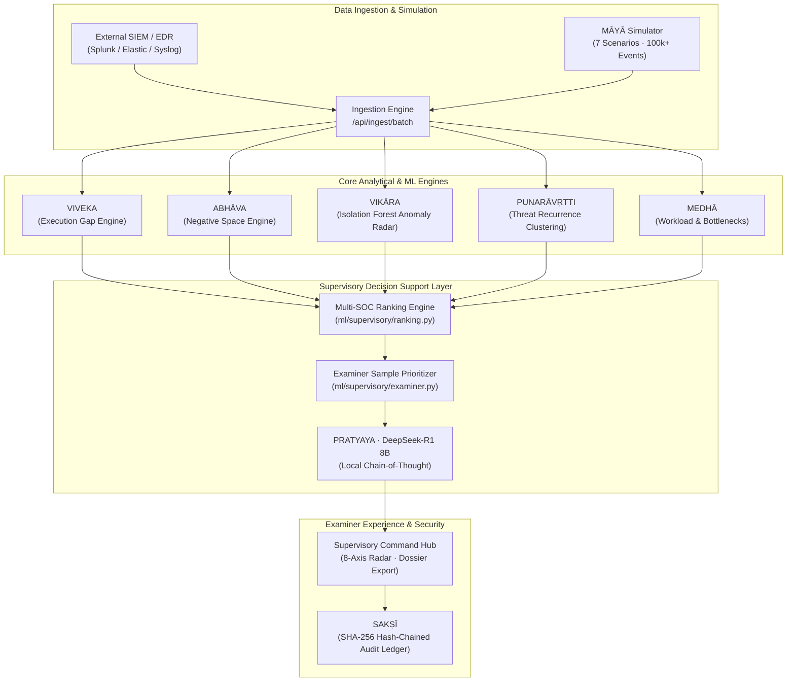

# ANVĪKṢA (SAT-SA)
### *Supervisory Analytics Tool for SOC Assessment*
**"Examine Beyond the Obvious."**

[](https://github.com)
[](infrastructure/verify_airgap.py)
[](data/evaluation/vikara/pipeline.json)
[](LICENSE)
[-red?style=flat-square)](https://www.sihbuddy.in/ps/SIH26157)

---

## 📌 Problem Statement & Mandate
* **Problem ID:** SIH26157 — Supervisory Analytics Tool for SOC Assessment (SAT-SA)
* **Organization:** National Technical Research Organisation (NTRO) / NCIIPC
* **Category:** Software / Miscellaneous (Defence & Intelligence)

The national infrastructure protection body assesses whether critical organisations' Security Operations Centres (SOCs) are **actually effective** by inspecting samples of their workflow exhaust. Conventional metrics like MTTR and alert closure volume are easily gamed. **ANVĪKṢA sits above existing SIEM/EDR tooling** to evaluate operational discipline, workflow completeness, and silent omissions without replacing human judgement.

---

## 🚀 Key Highlights & Differentiators

1. **The 8 Problem Statement Capability Dimensions**:
   Evaluates SOCs across all 8 mandated capability areas: *Threat Detection, Investigation Thoroughness, Escalation Completeness, Incident Response Latency, Security Operations Workload, Governance Adherence, Operational Discipline,* and *Cyber Resilience*.
2. **Multi-SOC Comparative Radar & Leaderboard**:
   Enables supervisory examiners to compare multiple organisations side-by-side on an interactive **8-Axis Radar/Spider Chart**, exposing capability drags and operational deltas.
3. **Deterministic Examiner Sample Prioritization**:
   Ranks suspicious cases with field-referencing, verifiable reason strings (e.g. `Closed in 4.2m with zero investigation notes`, `Bypassed mandatory supervisor sign-off`) so examiners know precisely which tickets to audit.
4. **Offline Examiner Audit Dossier (SHA-256 Sealed)**:
   Generates a 1-click forensic inspection dossier with an immutable cryptographic digest for physical on-site audits.
5. **100% Air-Gapped & Sovereign Execution**:
   Zero cloud APIs, zero external LLM egress, zero remote DBs. Powered locally by PostgreSQL, Redis, Scikit-Learn, and local **DeepSeek-R1 8B** via Ollama on `127.0.0.1:11434`.

---

## 🏛️ System Architecture



---

## 🧠 Core Intelligence Engines

| Engine Codename | Repository Module | Primary Responsibility |
| :--- | :--- | :--- |
| **VIKĀRA** | [`ml/vikara/`](ml/vikara/) | Semi-supervised Isolation Forest anomaly detection across 39 operational features. |
| **VIVEKA** | [`ml/anomaly/execution_gap.py`](ml/anomaly/) | Pinpoints execution gaps between expected workflow standards and actual actions. |
| **ABHĀVA** | [`ml/anomaly/negative_space.py`](ml/anomaly/) | Discovers negative-space anomalies — actions that *should* have occurred but were silently omitted. |
| **PRATYAYA** | [`backend/app/llm/`](backend/app/llm/) | Local DeepSeek-R1 8B supervisory reasoning generating executive briefings and root-cause explanations. |
| **PUNARĀVṚTTI** | [`ml/recurrence/`](ml/recurrence/) | Cosine/Jaccard similarity and time-decay clustering detecting recurring unaddressed threats. |
| **MEDHĀ** | [`backend/app/analytics/`](backend/app/analytics/) | Quantifies analyst burnout, triage velocity bottlenecks, and queue exhaustion. |
| **SAKṢĪ** | [`backend/app/audit/`](backend/app/audit/) | Append-only, SHA-256 hash-chained audit ledger guaranteeing tamper-evident records. |

---

## ⚡ Quick Start & Installation

### Prerequisites
* **Python 3.12+** (Tested on Python 3.14)
* **Node.js 18+** & npm
* **Docker & Docker Compose** (for local PostgreSQL & Redis)
* *(Optional)* **Ollama** running `deepseek-r1:8b` on `127.0.0.1:11434`

### 1. Clone & Configure
```bash
git clone https://github.com/your-org/anviksa.git
cd anviksa
cp .env.example .env
```

### 2. Start Local Infrastructure
```bash
docker-compose up -d postgres redis
```

### 3. Backend Setup
```bash
# Install dependencies
pip install -r backend/requirements.txt
pip install -e soc-simulator

# Initialize offline database schema
python backend/scripts/init_db.py

# Start FastAPI server
uvicorn backend.app.main:app --host 127.0.0.1 --port 8000
```

### 4. Frontend Setup
```bash
cd frontend
npm install
npm run dev
```
Open **[http://localhost:3000](http://localhost:3000)** (or `http://localhost:3001`).

---

## 🧪 Verification & Testing

ANVĪKṢA enforces 100% automated validation and strict air-gap constraints.

```bash
# 1. Run all backend tests (58 tests)
py -3.14 -m pytest backend/tests -q

# 2. Run all ML pipeline tests (59 tests)
py -3.14 -m pytest ml/tests -q

# 3. Run official air-gap verification (6/6 checks)
py -3.14 infrastructure/verify_airgap.py

# 4. Run ML benchmark evaluation (139 GT cases across 7 scenarios)
py -3.14 -m ml.evaluation.benchmark --datasets soc-simulator/datasets
```

---

## 📄 License & Governance
* **License:** Licensed under the **[Apache License 2.0](LICENSE)**.
* **Security & Responsible Disclosure:** See **[SECURITY.md](SECURITY.md)**.
* **Contribution Guidelines:** See **[CONTRIBUTING.md](CONTRIBUTING.md)**.
