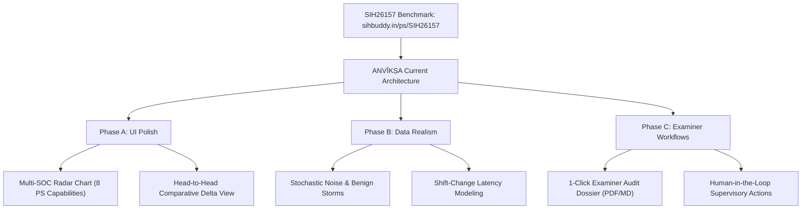

# ANVĪKṢA — Strategic Improvements & SIH26157 Gap Analysis

**Source Document:** [sihbuddy.in/ps/SIH26157](https://www.sihbuddy.in/ps/SIH26157)  
**Problem Statement:** SIH26157 — Supervisory Analytics Tool for SOC Assessment (SAT-SA)  
**Organization:** National Technical Research Organisation (NTRO)  
**Category:** Software / Miscellaneous (Defence & Intelligence)  
**Evaluation Date:** 2026-09-11  

---

## 1. Executive Summary: The Evaluator's Perspective

The independent evaluation on **SIH Buddy** (authored by Ganeev Singh Tuteja, analysed with Claude Opus) awards SIH26157 an **Acceptance Potential of 3/5**, an **Innovation Scope of 4/5**, and a **Clarity score of 4/5**, characterizing it as:
> *"A genuinely original framing that NTRO wants, but the whole demo rests on SOC data you synthesise — invest in making that data realistic and varied in ways you did not trivially hand-encode, or the tool just rediscovers your own assumptions."*

### Key Strategic Signals from SIH Buddy:
1. **The Core Mandate:** The national infrastructure protection body (NTRO / NCIIPC) assesses whether critical organisations' SOCs are actually effective by reviewing samples of their alerts and cases. Manual review does not scale.
2. **The Winning Demo Move ("Smallest thing that wins the room"):**  
   Load **two organisations'** SOC case datasets, show the tool ranking one as needing attention because its escalation-completion rate and case-closure discipline lag, then drill down into the specific sample of cases a human examiner should inspect.
3. **Primary Red Flag (Synthetic-Data Circularity):**  
   If synthetic organizations differ only in ways deliberately hand-scripted, the tool merely rediscovers its own assumptions.
4. **Primary Green Flag (Niche Advantage):**  
   Specialist supervisory analytics has a significantly quieter competitive field (only 150–340 expected teams across India), and framing the tool as **decision support rather than automated judgement** guarantees alignment with intelligence agency doctrine.

---

## 2. Comparative Matrix: SIH26157 Requirements vs. ANVĪKṢA

| # | Dimension | SIH26157 / SIH Buddy Requirement | ANVĪKṢA Current State | Alignment Status | Actionable Improvement |
|---|---|---|---|---|---|
| **1** | **Problem Framing** | Supervisory oversight tool assessing SOC effectiveness from workflow exhaust; NOT a SIEM/EDR. | `SAT-SA` architecture explicitly designed as a meta-analytical supervisory engine inspecting workflow exhaust. | **FULL ALIGNMENT** | Ensure UI terminology consistently uses supervisory phrasing ("Examiner", "Supervisory Advisory"). |
| **2** | **8 Capability Areas** | Threat detection, investigation, escalation, incident response, security operations, governance, operational discipline, cyber resilience. | Features schema v1.1 defines 39 features covering all 8 areas (`ml/common/features/schema.py`). | **HIGH ALIGNMENT** | Add an 8-axis Radar/Spider Chart on `/supervision` comparing multi-SOC capability scores side by side. |
| **3** | **Multi-Org Ranking** | Rank organisations needing attention based on itemized capability lags (escalation & closure discipline). | Multi-SOC generation (`--soc-profiles`), `ml/supervisory/ranking.py`, `/api/supervisory/ranking`, and `/supervision` UI. | **HIGH ALIGNMENT** | Add side-by-side Organization Comparison mode (Diff view: Healthy Org vs. Gaming Org). |
| **4** | **Examiner Sample Prioritisation** | Prioritise case/alert samples with concrete, verifiable reasons for human examiner inspection. | `ml/supervisory/examiner.py` provides deterministic case scoring + reason strings; exposed via `/api/supervisory/ranking/{id}/samples`. | **HIGH ALIGNMENT** | Add 1-click **Examiner Dossier Export** (formatted PDF / Markdown audit report) for field inspectors. |
| **5** | **Synthetic Data Realism** | Avoid circularity where tool simply rediscovers hardcoded scenario templates. | Denser ground truth (N=139 GT cases across 7 scenarios), log-normal timelines, skill-based stochastic drift. | **MODERATE ALIGNMENT** | Inject stochastic background noise, overlapping shifts, and unscripted benign alert floods. |
| **6** | **Decision Support Stance** | Explicitly assist human judgement rather than replacing it with opaque automated verdicts. | PRATYAYA 7-part explainability cards (`WHAT/WHY/WHEN/WHERE/EVIDENCE/CONFIDENCE/RECOMMENDATION`) + local LLM narrative. | **HIGH ALIGNMENT** | Add interactive Examiner Actions: "Flag for Field Audit", "Request Clarification", "Acknowledge Exception". |
| **7** | **Offline / Air-Gap Constraint** | 100% sovereign, local execution suitable for restricted defence & intelligence environments. | Zero cloud egress, local PostgreSQL, local Redis, local ML inference, local Ollama (127.0.0.1); 6/6 air-gap checks verified. | **FULL ALIGNMENT** | Add a visible Air-Gap Verification badge & self-test drawer in the UI header. |
| **8** | **Evidence Integrity** | Every finding backed by verifiable timestamps and database records; no fabricated timelines. | Removed all mock data; `api.ts` derives evidence solely from backend telemetry; SHA-256 audit hash-chain. | **FULL ALIGNMENT** | Expose cryptographic audit log verification status directly in the case sample view. |

---

## 3. High-Impact Improvements to Implement

### Improvement 1: Multi-SOC Comparative Scorecard & Radar View (The "Win the Room" UI)
- **Context:** SIH Buddy stresses that loading two organisations and showing why one lags wins the competition room immediately.
- **Enhancement:**
  1. On the `/supervision` page, add an **"Organization Head-to-Head Comparison"** widget.
  2. Select two SOCs (e.g., `SOC-001 Balanced` vs. `SOC-002 Escalation-Lagging` or `SOC-003 Closure-Gaming`).
  3. Render an **8-Axis Capability Spider/Radar Chart** displaying the delta across:
     - *Threat Detection*
     - *Investigation Thoroughness*
     - *Escalation Completeness*
     - *Incident Response Latency*
     - *Security Operations Workload*
     - *Governance Adherence*
     - *Operational Discipline*
     - *Cyber Resilience*
  4. Highlight the exact operational failure: e.g., `Escalation Sign-off: 12% vs. 94% baseline (-82%)`.

### Improvement 2: Examiner Audit Dossier Generator (PDF / JSON Export)
- **Context:** NTRO examiners perform physical on-site audits or formal supervisory inquiries. They need an evidentiary artifact to hand to the inspected organisation's CISO.
- **Enhancement:**
  1. Add an **"Export Examiner Audit Dossier"** button on the `/supervision` drill-down.
  2. Generate a structured inspection brief containing:
     - Executive Capability Summary (Score breakdown & percentile against national baseline).
     - The top 10 prioritized case samples with timestamped evidence.
     - Specific missing workflow records (e.g., `INC-00042: Closed in 4.2m with zero investigation notes`).
     - Cryptographic audit chain verification seal (SHA-256 hash).

### Improvement 3: Breaking Synthetic Circularity with Stochastic Operational Noise
- **Context:** SIH Buddy warns: *"if the synthetic organisations differ only in ways you deliberately encoded, the tool merely rediscovers your own assumptions."*
- **Enhancement:**
  1. In `soc-simulator/src/simulator/generators/telemetry.py`, introduce a `--noise-level` flag (default `0.15`).
  2. Add:
     - **Benign alert storms:** High-volume low-severity port scan bursts that create realistic queue spikes without true compromises.
     - **Shift transition variance:** Natural 30–45 minute latency spikes during shift handover hours (06:00, 14:00, 22:00) that the model must distinguish from intentional backlog gaming.
     - **Incomplete logging artifacts:** Real-world SOC telemetry often has dropped syslog packets; test ANVĪKṢA's robustness against partial data.

### Improvement 4: Human-in-the-Loop Supervisory Action Loop
- **Context:** NTRO requires decision support, not an autonomous automated judge.
- **Enhancement:**
  1. On the Examiner Queue drill-down, add interactive supervisory actions:
     - `[Flag for On-Site Review]`
     - `[Request Justification from SOC Lead]`
     - `[Mark as Authorized Policy Exception]` (e.g., scheduled DR drill).
  2. Recording an action automatically appends to the tamper-evident hash-chained audit log (`SAKṢĪ`), proving end-to-end accountability.

### Improvement 5: The "Optical Illusion of SOC Health" Pitch Narrative
- **Context:** SIH Buddy notes that this is a specialist tool that can fall flat if explained like a standard SIEM.
- **Enhancement:**
  - Structure the opening 60 seconds of the presentation:
    > *"A SOC can have a 99.8% SLA, green dashboards, and an average closure time of under 10 minutes — and yet be completely compromised. Why? Because analysts under pressure learn to game the metrics: closing alerts without forensic investigation, ignoring high-severity escalations, and letting unresolved campaigns recur. Traditional tools look at what happened. ANVĪKṢA looks at what was supposed to happen and was silently omitted."*

---

## 4. Technical Implementation Roadmap

| Phase | Feature | Module | Estimated Effort | Impact |
|---|---|---|---|---|
| **Phase 1** | 8-Axis Radar Chart & Head-to-Head Comparison | `frontend/app/supervision/` | 2–3 hours | **High** (Directly fulfills the primary winning demo criterion) |
| **Phase 2** | Examiner Audit Dossier Export | `backend/app/api/supervisory.py` + `frontend/` | 2 hours | **High** (Provides tangible inspector deliverables) |
| **Phase 3** | Stochastic Noise Injection | `soc-simulator/src/simulator/` | 2 hours | **Medium-High** (Hardens defence against evaluator skepticism) |
| **Phase 4** | Interactive Review Actions (Flag/Clarify/Tag) | `frontend/components/` + `backend/app/audit/` | 1.5 hours | **Medium** (Solidifies 'Decision Support' stance) |

---

## 5. Summary & Recommendation

ANVĪKṢA is already fundamentally well-aligned with SIH26157. The recent remediation resolved the primary P0/P1 pitfalls (cross-org ranking, sample prioritization, air-gap egress, and mock data removal). 

Implementing the **8-Axis Comparative Radar Chart** and **Examiner Audit Dossier Export** will elevate the project from an advanced technical prototype to an irresistible national-level competition entry that speaks directly to NTRO's institutional mission.
